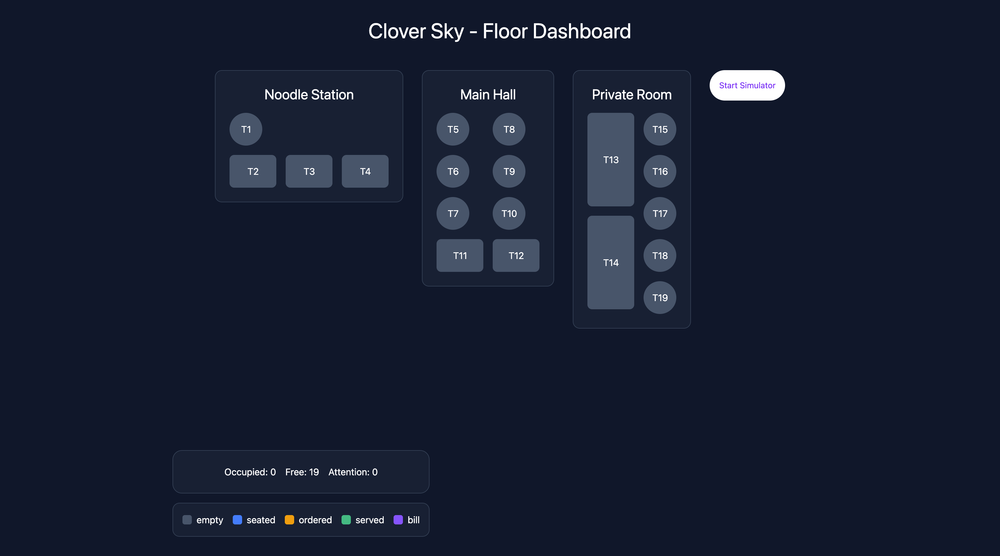

# Clover Sky - Floor Dashboard
A real-time restaurant floor monitoring dashboard built with React — imagine sensors installed under each table, automatically tracking guest status from seating to bill.

[Live Demo](https://clover-sky-restaurant.vercel.app/)

## Features
- 19-table floor map across 3 restaurant sections
- Click-to-cycle status tracking (empty → seated → ordered → served → bill)
- Real-time elapsed-time timers per table
- Track which table is required attention by looking at the red border
- Legend label for non-tech user friendly
- Total number of tables, total occupied tables and total attention tables
- Simulate tables just by pressing start/stop button instead of manual click

## Tech Stack + Architecture Note 
Rather than passing props through multiple layers of components (prop drilling), status data is managed globally using React's Context API paired with useReducer — allowing any component to read or update table status directly, regardless of its position in the component tree.

- React + React DOM
- Vite
- Tailwind css

